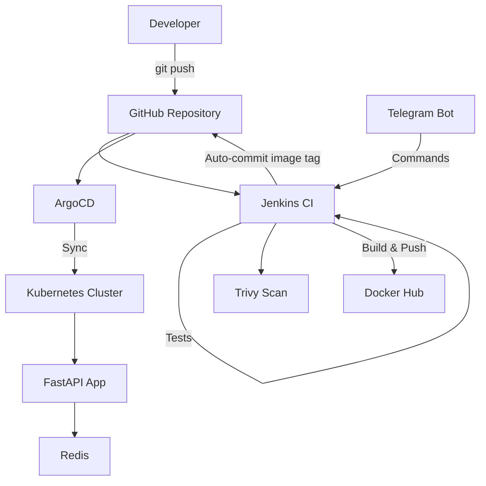

# 🚀 DevOps Portfolio App — Full-Stack CI/CD, GitOps & ChatOps Automation

<p align="center">
  
  
  
  
  
  
  
  
</p>

---

## 📌 Overview

Este repositorio es un **laboratorio DevOps / DevSecOps / ChatOps de nivel profesional**, diseñado para demostrar cómo una aplicación **Full-Stack** puede ser **construida, asegurada, desplegada y operada** de forma totalmente automatizada.

El proyecto integra **CI/CD**, **GitOps**, **DevSecOps** y **ChatOps**, permitiendo incluso **disparar despliegues y acciones operativas desde Telegram** mediante comandos simples.

Stack principal:

* **FastAPI + Redis** (Aplicación)
* **Docker (Multi-stage, Hardened)**
* **Jenkins (CI)**
* **Trivy (Security Scanning)**
* **Kubernetes (Runtime)**
* **ArgoCD (GitOps CD)**
* **Telegram Bot (ChatOps)**

---

## 🏗️ System Architecture

### 🔍 High-Level Architecture Diagram



---

## 🧩 Architecture Layers

1. **Application Layer**

   * FastAPI REST API
   * Redis como datastore en memoria

2. **Containerization & Hardening**

   * Docker multi-stage
   * Alpine Linux
   * Usuario no-root
   * Runtime sin herramientas de build

3. **CI — Jenkins**

   * Tests unitarios con Pytest y mocks
   * Escaneo de seguridad (Trivy)
   * Build reproducible

4. **Artifact Management**

   * Docker Hub con versionado automático

5. **CD — GitOps**

   * ArgoCD sincroniza estado del clúster
   * Git como única fuente de verdad

6. **ChatOps — Telegram**

   * Bot de Telegram para ejecutar acciones
   * Deploys y operaciones desde chat

---

## 🛡️ DevSecOps & Image Hardening Strategy

* **Base mínima:** Alpine Linux (~50MB)
* **Segregación de dependencias:** builder vs runtime
* **Runtime hardened:** sin `pip`, `apk`, ni herramientas innecesarias
* **Security Gates:**

  * Trivy integrado en Jenkins
  * Falla automática ante CVEs `HIGH` / `CRITICAL`

---

## 🔄 CI/CD + GitOps Workflow

### Continuous Integration — Jenkins

* Checkout del código
* Tests unitarios
* Escaneo de vulnerabilidades
* Build de imagen Docker
* Push a Docker Hub
* **Auto-commit:** actualización automática del tag en `k8s/app.yaml`

### Continuous Delivery — ArgoCD

* Detecta cambios en Git
* Sincroniza Kubernetes automáticamente
* No expone credenciales del clúster al CI

---

## 🤖 ChatOps — Telegram Bot Integration

Este proyecto incluye un **bot de Telegram** que permite interactuar con Jenkins mediante comandos simples.

### 📂 Componentes

* `bot.py` — Bot principal de Telegram
* `.env` — Variables sensibles (local only)

### 🔐 Variables de Entorno (.env)

```env
TELEGRAM_BOT_TOKEN=xxxxxxxx
TELEGRAM_CHAT_ID=xxxxxxxx
JENKINS_URL=http://localhost:8080
JENKINS_USER=admin
JENKINS_API_TOKEN=xxxxxxxx
JENKINS_JOB_NAME=portfolio-pipeline
```

> ⚠️ El archivo `.env` **no debe subirse al repositorio**.

### 💬 Comandos Disponibles (Ejemplo)

* `/deploy` → Dispara el pipeline en Jenkins
* `/status` → Consulta estado del último build
* `/help` → Lista de comandos disponibles

Esto habilita un flujo **ChatOps real**, donde operaciones críticas se ejecutan directamente desde mensajería.

---

## 🚀 Deployment Guide (Local Lab)

### Prerequisites

* Git
* Docker Desktop (con Kubernetes habilitado)
* VS Code

### Run Jenkins

```bash
docker run -d \
  -p 8080:8080 \
  -p 50000:50000 \
  --name devops-jenkins \
  -v /var/run/docker.sock:/var/run/docker.sock \
  jenkins/jenkins:lts
```

### Deploy to Kubernetes

```bash
kubectl apply -f k8s/
kubectl get pods
```

Acceso a la app 👉 [http://localhost](http://localhost)

---

## 📂 Repository Structure

```text
.
├── app/                # FastAPI application
├── bot.py              # Telegram ChatOps bot
├── k8s/                # Kubernetes manifests
├── tests/              # Unit tests
├── Jenkinsfile         # CI/CD pipeline
├── Dockerfile          # Hardened multi-stage build
├── docker-compose.yml  # Local dev
├── requirements.txt
└── .env.example        # Environment variables template
```

---

## 🧪 Resilience & Auto-Healing Test

```bash
kubectl get pods
kubectl delete pod <pod-name>
```

Kubernetes recrea el pod automáticamente.

---

## 👤 Author

**Carlos Javier**
DevOps / Cloud Engineer

---

# 🌍 English Version

## Overview

This repository is a **professional-grade DevOps / DevSecOps / ChatOps laboratory**, showcasing how a **full-stack application** can be built, secured, deployed, and operated using **modern cloud-native practices**.

The project integrates **CI/CD**, **GitOps**, **DevSecOps**, and **ChatOps**, enabling **deployments and operational actions directly from Telegram**.

---

## Architecture Summary

* FastAPI + Redis application
* Hardened Docker images (Alpine, non-root)
* Jenkins-based CI pipeline
* Trivy vulnerability scanning
* Kubernetes runtime with auto-healing
* ArgoCD for GitOps-based CD
* Telegram bot for ChatOps

---

## CI/CD & GitOps Flow

1. Developer pushes code to GitHub
2. Jenkins runs tests, security scans, and builds Docker images
3. Image is pushed to Docker Hub
4. Jenkins auto-commits the new image tag
5. ArgoCD detects Git changes and syncs Kubernetes
6. Application is deployed automatically

---

## ChatOps with Telegram

A Telegram bot allows triggering Jenkins jobs and operational commands via chat:

* `/deploy` — Trigger CI/CD pipeline
* `/status` — Check last build status
* `/help` — Available commands

Secrets are managed via `.env` files for local testing.

---

## Why This Project Matters

This repository demonstrates:

* Real-world DevOps workflows
* Security-first containerization
* GitOps best practices
* Production-like Kubernetes deployments
* ChatOps-driven operations

It is designed as a **portfolio project** for **DevOps / Cloud Engineer roles**.

---

⭐ If you find this project useful, consider giving it a star
